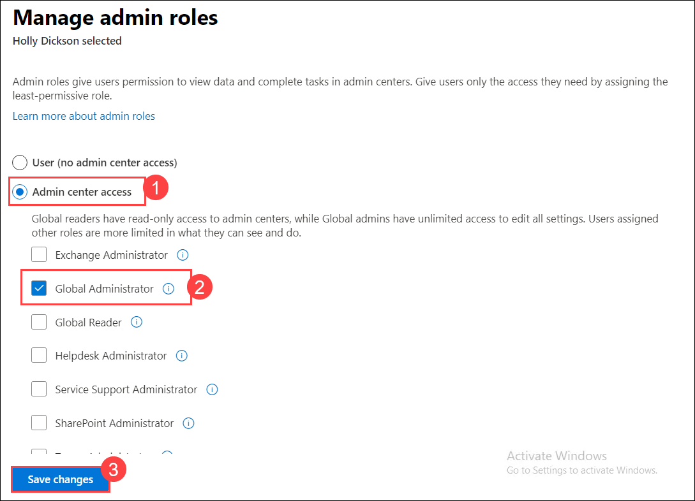
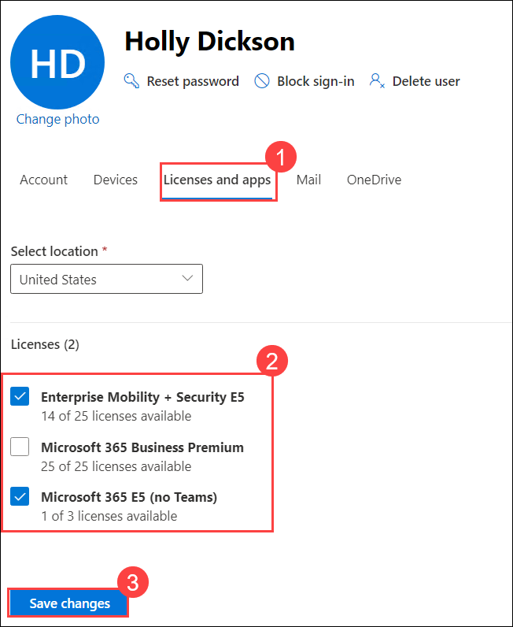
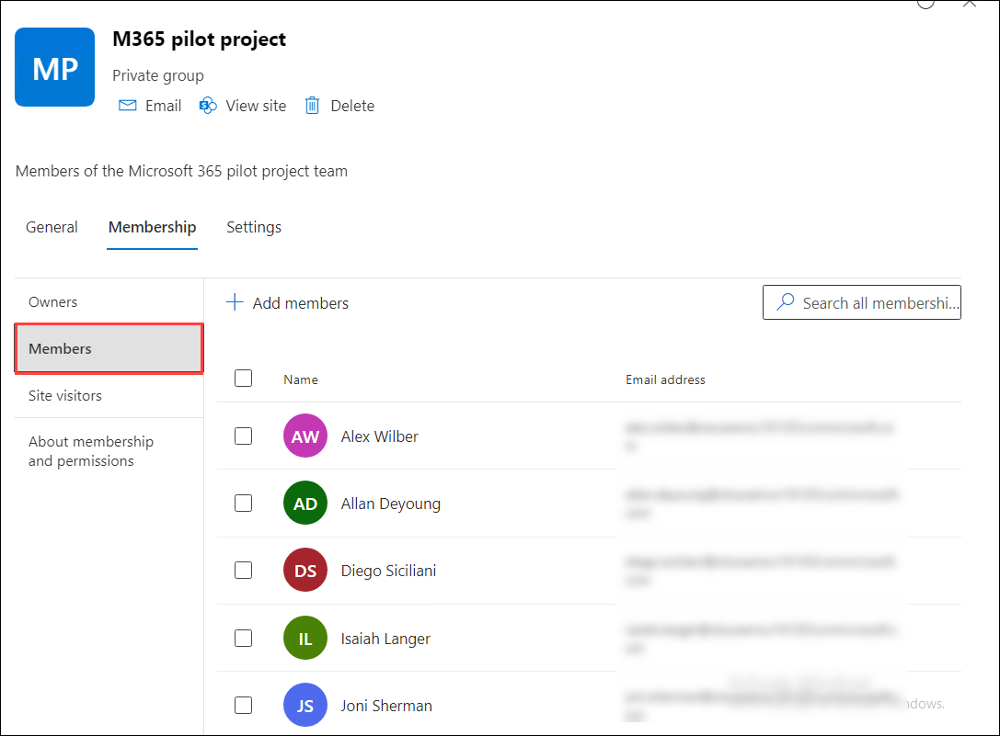
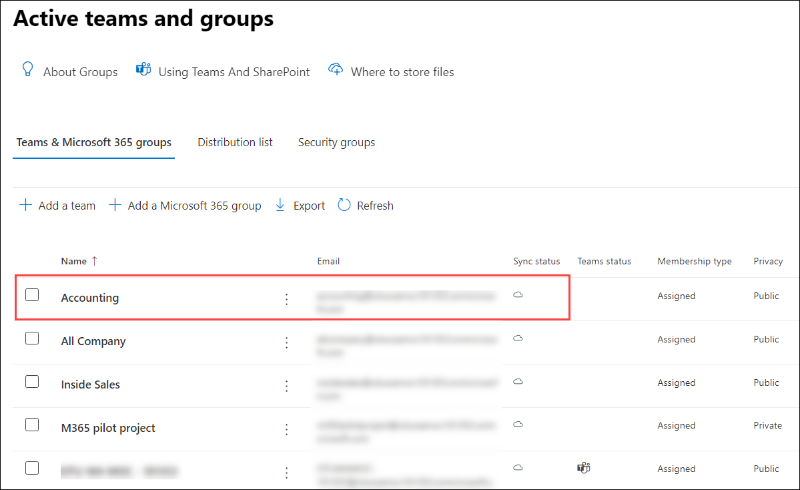
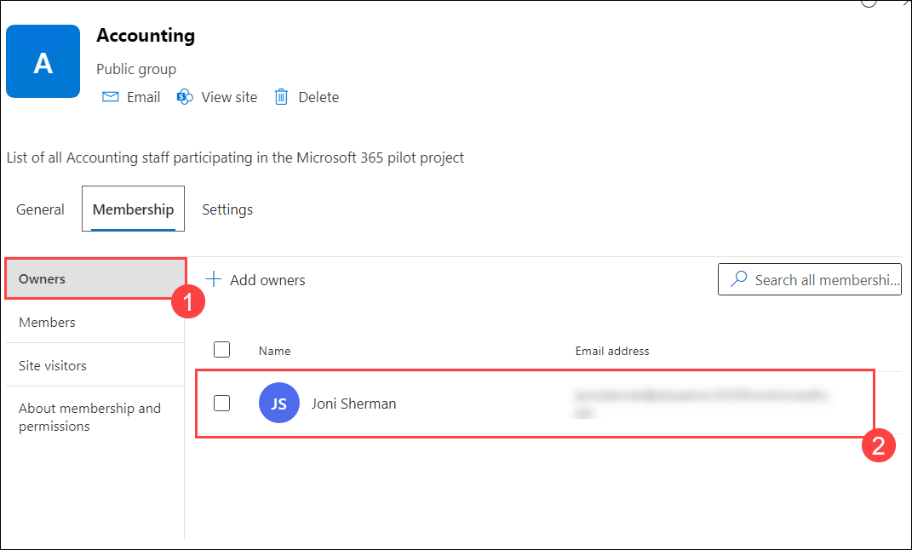
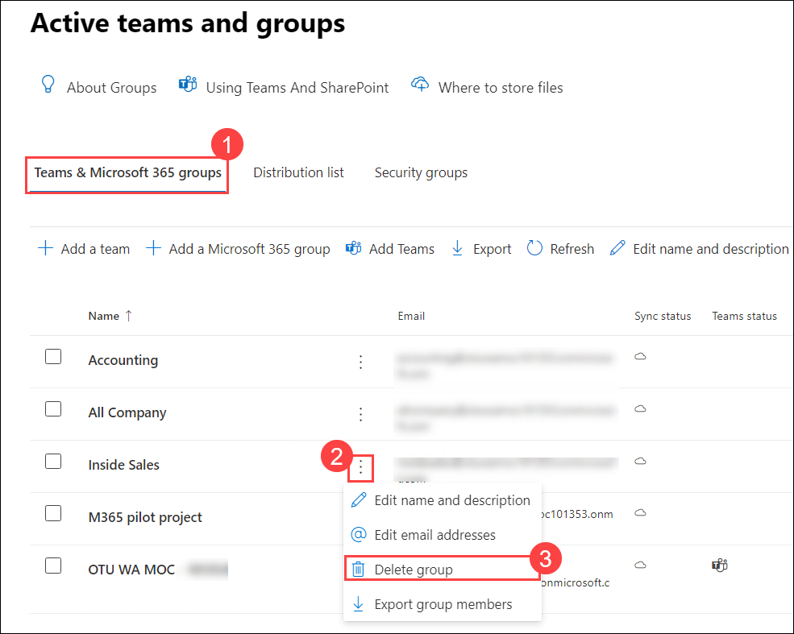
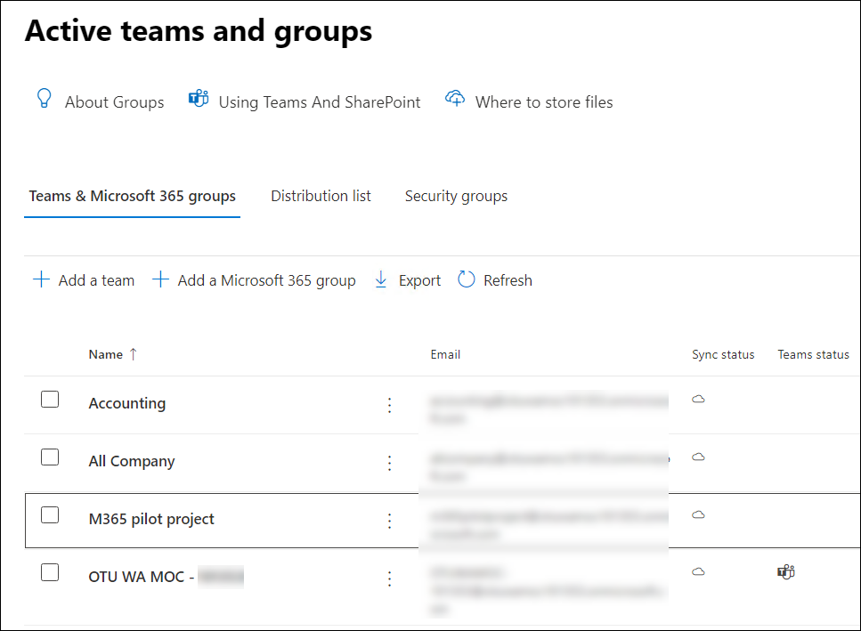
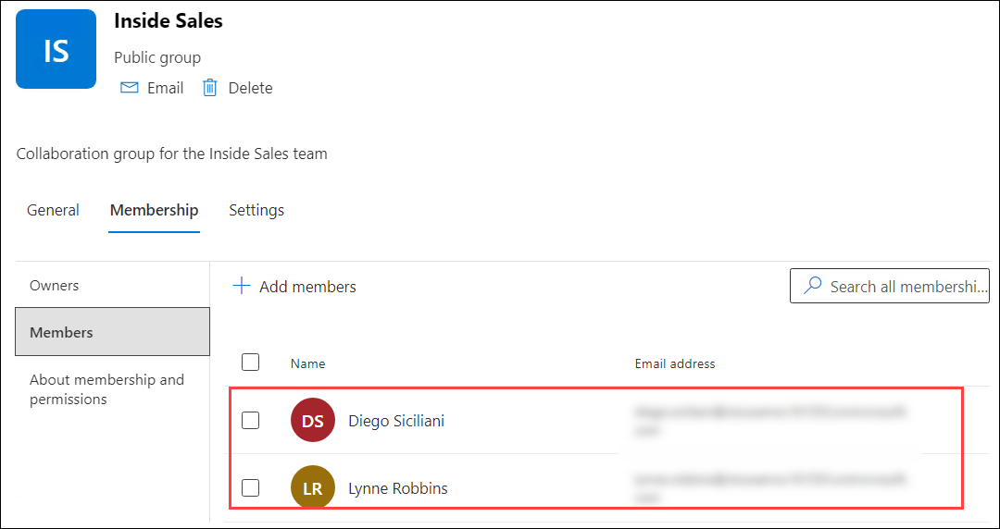

# Learning Path 1 - Lab 1 - Exercise 2 - Manage Users and Groups 

## Lab scenario

In the following lab exercise, you will continue in your role as Holly Dickson, Adatum's new Microsoft 365 Administrator. In this exercise, you will perform several user and group management functions within Microsoft 365. You will be assigning the Microsoft 365 Global Administrator role. You will create several Microsoft 365 groups and assign existing Microsoft 365 users as members of those groups. You will then delete one of the groups and then use Windows PowerShell to recover the deleted group.

>**Note:** The VM environment provided by your lab hosting provider comes with over 20 existing Microsoft 365 user accounts, as well as a large number of existing on-premises user accounts. Several of the existing Microsoft 365 user accounts will be used throughout the labs in this course. Even though the ODL user account has been created by your lab hosting provider. It will also provide you with the experience of creating a Microsoft 365 user account in case you're not familiar with the process.


### Task 1 - Manage Roles and Licenses for Adatum Microsoft 365 Users

1. On the LON-CL1 VM, the **Microsoft 365 admin center** should still be open in your Microsoft Edge browser from the prior lab exercise. You should be signed into Microsoft 365 as the **ODL user**. 

1. In the **Microsoft 365 admin center** navigation pane, select **Users** and then select **Active users**. In the **Active users** list, you will see the list of existing user accounts that were created by your lab hosting provider.

1. On the **Active users** page, in the list of users, select **Holly Dickson**.

	- Select **Reset Password**. On the **Reset Password** page. Clear (uncheck) the **Automatically create a password** check box, which will display a new field for entering an administrator defined password, enter the same **Microsoft 365 Tenant Password** provided by your lab hosting provider for the tenant admin account (i.e. <inject key="AzureAdUserPassword"></inject>)

	- Clear (uncheck) the **Require this user to change their password when they first sign in** check box 

1. Select **Reset Password** button. If a **Save password** dialog box appears towards the top of the screen, select **Never**.

1. Now on the **Holly Dickson** page. Select **Manage Roles** under **Roles** section. 

	

	>**Note:** All the admin roles will be displayed if you select **Show all by category**, which appears after the last common role. For Holly, you don't need to view all the admin roles by category, since Holly will be assigned the Global Administrator role that appears in the list of commonly used roles.

1. Select the **Admin center access (1)** option. By selecting this option, the most commonly used Microsoft 365 administrator roles are enabled below it. Select the **Global Administrator (2)** check box. Select **Save changes (3)**, and navigate back to the Holly Dickson page.

	

1. Select **Licenses and apps (1)**,

	- Licenses: Select the **Enterprise Mobility + Security E5** and **Microsoft 365 E5** **(2)** check boxes.

1. Select **Save changes (3)**.

	

1. Select **Close.**

	>**Note:** If a window appears asking whether you want to respond to a survey on your experience, select **Cancel**.

1. Remain logged into the Client 1 VM (LON-CL1) with the Microsoft 365 admin center open in your browser for the next task.

### Task 2 – Set up Microsoft 365 User Accounts

1. Select the user icon for the **ODL user** (the **O1** circle) in the upper right corner of your browser. In the **ODL user** window that appears, select **Sign out.**
	
	>**Important:** When signing out of one user account and signing in as another, you should close all your browser tabs except for the **Sign out** tab. This is a best practice that helps to avoid any confusion by closing the windows associated with the prior user. Once you're signed out of the ODL user account, take a moment and close all other browser tabs except for the **Sign out** tab. 
	
1. In your Microsoft Edge browser, in the **Sign out** tab, enter the following URL in the address bar to sign back into Microsoft 365: **https://portal.office.com**. 

1. In the **Pick an account** window, select **Use another account**. 

1. In the **Sign in** window, enter Holly@yourtenant.onmicrosoft.com (where yourtenant is the tenant prefix provided by your lab hosting provider). Select **Next**.

1. In the **Enter password** window, enter <inject key="AzureAdUserPassword"></inject> and then select **Sign in**.

1. If a **Welcome to Microsoft 365** dialog box appears in the middle of the screen, there's no option to close it. Instead, to the right of the window, select the forward arrow icon (**>**) two times and then select the check mark icon to advance through the slides in this messaging window. 

1. If a **Find more apps** window appears, select the **X** in the upper right-hand corner of the window to close it. 

1. The **Welcome to Microsoft 365** page appears in your Edge browser in the **Home | Microsoft 365** tab. This is Holly's Microsoft 365 home page. Note that Holly's initials appear in the upper-right corner of the screen, however, Holly's name is not displayed. This is because Holly's account did not exist at the time you added the Microsoft 365 pilot project users to the group that was associated with the custom theme in the prior lab exercise. Since Holly wants to see her name at the top of each Microsoft 365 window when she's logged into the system, she first wants to add her account to the group of Microsoft 365 pilot project users.

1. In the column of application icons that appears on the far left-side of the screen, select **Admin**. This opens the **Microsoft 365 admin center** in a new browser tab. 

1. In the **Microsoft 365 admin center**, select **Teams & groups** in the navigation pane, and then under it, select **Active teams & groups**. 

1. In the **Active teams and groups** page, there's a tab for viewing each of the group types. The **Teams & Microsoft 365 groups (1)** tab is displayed by default, this tab displays the existing Microsoft 365 teams & groups. In the list of Microsoft 365 teams & groups, select **M365 pilot project (2)**.

	

1. In the **M365 pilot project** pane that appears, the **General** tab is displayed by default. Select the **Membership** tab.

1. In the **Membership** tab, the **Owners** sub-tab is displayed by default in the navigation pane. Select the **Members** sub-tab that appears below it.

	

1. In the **Members** sub-tab, select **+ Add members**.

1. In the **Add team members to M365 pilot project** pane that appears, select inside the **Search by name or email address** field. In the list of users that appears, scroll down and select **Holly Dickson**. Select the **Add (1)** button, and then go back to the **M365 pilot project** pane, in the **Members** sub-tab.

1. Select the **Refresh** icon that appears at the top of the screen, to the left of the address bar. Note how Holly Dickson's name appears next to her initials in the upper-right corner of the screen (Note: you may have to refresh twice to see Holly's name), then close the **M365 pilot project** page.

	

1. In the **Microsoft 365 admin center**, in the left-hand navigation pane, select **Users**, and then under it, select **Active users**.

1. In the **Active Users** window, when you hover your mouse over a user's **Display name**, a **key icon** appears to the right of the user's name. By selecting the key icon, you can reset a user's password. You must reset the passwords for **Alex Wilber, Joni Sherman, Lynne Robbins, and Patti Fernandez** to the same **Microsoft 365 Tenant Password**.

1. Hover your mouse over **Alex Wilber** and select the key icon that appears.

1. In the **Reset password** pane for Alex, clear (uncheck) the **Automatically create password** check box. 

1. In the **Password** field that appears, enter the same **Microsoft 365 Tenant Password** provided by your lab hosting provider for the tenant admin account (i.e. the ODL user account). Select the eye (**Show Password**) icon at the end of the **Password** field to display the value that you entered. Verify that you correctly entered the tenant password.

1. Clear (uncheck) the **Require this user to change their password when they first sign in** check box.

1. Select **Reset Password**. If a **Save password** dialog box appears at the top of the screen, select **Never**. Then select **Close** on the **Password has been reset** pane.

1. Repeat steps 17-21 for **Joni Sherman**, **Lynne Robbins**, and **Patti Fernandez**. For these three accounts, reset each of their passwords to the same **Microsoft 365 Tenant Password** 
	- Password:- <inject key="AzureAdUserPassword"></inject>

1. Remain logged into LON-CL1 with the **Microsoft 365 admin center** open in your browser for the next task.

### Task 3 – Set up Microsoft 365 Groups 

1. On LON-CL1, in your Edge browser, you should still be logged into Microsoft 365 as **Holly Dickson**. 

1. In the **Microsoft 365 admin center**, select **Teams & groups** in the navigation pane, and then under it, select **Active teams & groups**. 

1. In the **Active teams and groups** page, there's a tab for viewing each of the group types. The **Teams & Microsoft 365 groups** tab is displayed by default, this tab displays the existing Teams & Microsoft 365 groups.  

1. Select the **+ Add a Microsoft 365 group** option that appears on the menu bar above the list of groups. This initiates the **Add a group** wizard. 

1. In the **Set up the basics** page, enter **Inside Sales** in the **Name** field, and then enter **Collaboration group for the Inside Sales team** in the **Description** field (Note: even if you don't enter a description, you must still select into this field to enable the **Next** button). Select **Next**.

1. You will now assign Allan Deyoung and Patti Fernandez as owners of the Inside Sales group. In the **Assign owners** window, select **+ Assign owners**.
	
1. In the **Assign owners** pane that appears, select the check boxes next to **Allan Deyoung** and **Patti Fernandez**, and then select the **Add (2)** button at the bottom of the pane.

1. On the **Assign owners** page, Allan and Patti should appear as owners of the group. Select **Next**.

1. You will now assign Diego Siciliani and Lynne Robbins as members of the Inside Sales group. In the **Add members** page, select **+ Add members**.

1. In the **Add members** pane that appears, select the check boxes next to **Diego Siciliani** and **Lynne Robbins**, and then select the **Add (2)** button at the bottom of the pane.

1. On the **Add members** page, Diego and Lynne should appear as members of the group. Select **Next**.

1. In the **Edit settings** page, enter the following information: 

	- Enter **insidesales** in the **Group email address** field.
	
	- In the **Privacy** field, **Public** should be selected by default. Do not change this value.

1. In the **Review and finish adding group** page, review the content that you entered. If anything needs to be fixed, select **Edit** under the specific area that needs adjustment, make any necessary corrections, and then select **Next** to continue back to this page. Once everything is correct, select **Create group**.

1. It may take a minute or so for the **Inside Sales** group created window to appear. Note the comment at the top of the page that it may take 5 minutes for the new group to appear in the list of Active groups.

1. Select **Close**. This returns you to the **Active teams and groups** page, which should display the **Microsoft 365** group tab. Since the Inside Sales group was a Microsoft 365 group, it should eventually display on this tab.

1. Repeat steps 3-14 to add a new group with the following information: 

	- Name: **Accounting**

	- Description: **List of all Accounting staff participating in the Microsoft 365 pilot project**

	- Owner: **Joni Sherman**

	- Members: You will not add members at this time.  **Note:** You can add members to a group at the time you create the group (as you did with the Inside Sales group), as well as after you create a group. For the purpose of this Accounting group, you will add members after you've created the group. This way you can see the two methods of adding group members. So for now, select **Next** to skip through this step and not add members at this time. 

	- Group email address: **accounting**

	- Privacy: **Public**

1. After creating the Accounting group, you will be returned to the **Active teams and groups** window. It may take a few minutes for the Accounting group to appear, so you may need to select the **Refresh** option on the menu bar once or twice. Note that there are three tabs on this page, (Teams & Microsoft 365 groups, Distribution list, and Security groups). The **Teams & Microsoft 365 groups** tab is displayed by default. So the Accounting group should be displayed in this tab.

1. Once the **Accounting** group appears under the **Teams & Microsoft 365 groups** tab, select the **Accounting** name. You will now add members to this group.

	

1. In the **Accounting** pane that appears, the **General** tab is displayed by default. Select the **Membership** tab.

1. In the **Membership** tab, four sub-tabs (Owners, Members, Site visitors, and About membership and permissions) are displayed in the left-hand column. The **Owners** sub-tab is displayed by default. In the **Owners** sub-tab, **Joni Sherman** should appear as the only group owner. 

	

1. Select the **Members** sub-tab. In the **Members** sub-tab, select the **Add members** button. 

1. In the **Add team members to Accounting** pane, select in the **Search by name or email address** field. This displays the list of active users.

1. In the list of users, select **Alex Wilber**,  **Joni Sherman**, and then select **Lynne Robbins**. Once all three users are selected, select the **Add (3)** button at the bottom of the pane.

1. Once the three new members have been added to the group, select the **X** in the upper right-hand corner of the **Accounting** pane to close it. 

1. After adding members to the Accounting group, you will be returned to the **Active teams and groups** window. Select the **Security groups** tab to display the list of Security groups, and select **+ Add a security group**. Repeat steps 3-14 to add a new group with the following information: 

	- Name: **IT Admins**

	- Description: **IT administrative personnel**

	>**Note:** There is no owner, email address, or privacy setting for Security groups. Members must be added to a Security group after creating the group, which you will do in the next few steps. On the **Edit settings** page, you're NOT going to assign Azure AD roles to the group, so simply select **Next**.

1. After you finish adding the group, the **Active teams and groups** page should be displayed. Check whether the **IT Admins (2)** group appears under the **Security groups (1)** tab.   

	>**Tip:** If the group does not immediately appear in the list of Security groups, wait a minute or so and then select the **Refresh** option on the menu bar (to the right of **Add a group**). You may need to wait an additional minute or two for the group to appear.

	>**Note:** As you can see from the tabs on this page, there are two additional group types besides the Microsoft 365 and Security groups. These two group types are **Mail-enabled Security** groups and **Distribution** groups. Neither of these group types were used in this lab because it can take up to an hour for these two types of groups to appear in the Groups list; whereas Microsoft 365 groups and Security groups usually take just a minute to two to appear. 

	

1. You’re now ready to add members to the **IT Admins** security group. In the **Security groups** tab, select the **IT Admins** group (select the name and not the check box that appears to the left of the name). 

1. In the **IT Admins** pane that appears, the **General** tab is displayed by default. Select the **Members** tab.

1. The **Members** tab displays sections for the Owners and the Members. Under the **Members** section, you can see that there are no members. Under this section, select **View all and manage members** to add members to the group. 

1. In the **Members** pane that appears, select **+ Add members**. This displays the list of active Microsoft 365 users.

1. In the list of users, select the check boxes for **Isaiah Langer**, **Megan Bowen**, and **Nestor Wilke**, and then at the bottom of the pane select the **Add (3)** button. 

1. In the **Members** pane, verify the three users that you selected appear. Select the **X** in the upper right-hand corner to close the **Members** pane. 

	

1. You now want to test the effect of deleting a group. In the list of **Active teams and groups**, select the **Teams & Microsoft 365 groups (1)** tab. In the list of **Teams & Microsoft 365 groups**, locate the **Inside Sales** group and then select the vertical ellipsis icon (**More actions (2)**) that appears to the right of the **Inside Sales** group, select **Delete group (3)**. 

	

1. In the **Delete Inside Sales?** pane that appears, select the **Delete group** button.

1. Once the group is deleted, select the **Close** button. 

1. This will return you to the list of **Active teams and groups**. The **Inside Sales** group should no longer appear under the **Microsoft 365** tab. If the Inside Sales group still displays, wait a couple of minutes and then select the **Refresh** option on the menu bar. The updated **Active teams and groups** list should no longer include the Inside Sales group.

	

1. To verify whether deleting this group affected any of its owners or members, select **Active Users** in the navigation pane. 

1. In the **Active users** list verify that the Inside Sales group's two owners (**Allan Deyoung** and **Patti Fernandez**) and the two members (**Diego Siciliani** and **Lynne Robbins**) still appear in the list of users. This verifies that deleting a group does not delete the user accounts that were owners or members of the group.

1. Remain logged into LON-CL1 with the **Microsoft 365 admin center** open in your browser for the next task.

> **Congratulations** on completing the task! Now, it's time to validate it. Here are the steps:
> - If you receive a success message, you can proceed to the next task.
> - If not, carefully read the error message and retry the step, following the instructions in the lab guide. 
> - If you need any assistance, please contact us at labs-support@spektrasystems.com. We are available 24/7 to help you out.

<validation step="936c883d-0e2c-4883-9724-07ccddf45edc" />


### Task 4 – Recover Groups using PowerShell 

>**IMPORTANT - Microsoft Graph PowerShell work around:** In a normal situation, you would use the Restore-MgDirectoryDeletedItem cmdlet to restore a recently deleted application, group, servicePrincipal, administrative unit, or user object from the deleted items "container" (deleted items will remain available to restore for up to 30 days; after 30 days, the items are permanently deleted). This Microsoft Graph PowerShell cmdlet requires that you provide the object ID of the item being restored. While you would normally use the Get-MgDirectoryDeletedItem cmdlet to display the list of deleted objects (along with their object IDs), this cmdlet is currently not returning any data. As a workaround, this task will invoke a direct REST API call by using the Invoke-MgGraphRequest cmdlet.

>**NOTE - Microsoft Graph PowerShell:** If you'll recall, in the first lab exercise for this course, you installed Microsoft Graph PowerShell. However, you did not import any of its 30+ sub-modules. You were told at the time that only 3 modules will be used in the labs for this training course, so you would install each sub-module individually as they were needed. For this lab exercise, you will import the **Microsoft.Graph.Identity.DirectoryManagement** sub-module and the **Microsoft.Graph.Groups** sub-module. You will then connect to these sub-modules with the appropriate Read/Write permissions that are needed to view and recover a deleted group. 

1. On LON-CL1, if Windows PowerShell is still open from the previous lab exercise, select the **Windows PowerShell** icon on the taskbar; otherwise, you must open an elevated instance of Windows PowerShell just as you did before. Maximize your PowerShell window.

2. In the prior lab exercise, you installed Microsoft Graph PowerShell. You must now import both the **Microsoft.Graph.Groups** sub-module (which contains the cmdlets to view and maintain Microsoft groups) and the **Microsoft.Graph.Identity.DirectoryManagement** sub-module (which contains the cmdlets necessary to recover the deleted group). To do so, type the following commands and then press Enter:  
	```powershell
	Import-Module Microsoft.Graph.Groups
	
	Import-Module Microsoft.Graph.Identity.DirectoryManagement
	```

3. At the command prompt, you must now connect to Microsoft Graph and perform a request for permission to use the cmdlets that were just imported. Microsoft Graph PowerShell permissions are NOT pre-authorized. As such, you must perform a one-time, per-module request for permissions depending on your needs. 

	- The 'Group.ReadWrite.All' scope is required to display the current list of active groups and restore the deleted group. 
	- The 'Directory.ReadWrite.All' scope provides permission to read and write data in Adatum's directory, such as users and groups, and restore the deleted group. 

	Copy and paste the following command and then press Enter: 
	
	```powershell
	Connect-MgGraph -Scopes 'Group.ReadWrite.All', 'Directory.ReadWrite.All'
	```
4. A **Sign in** window will appear requesting your credentials. Sign in using Holly@yourtenant.onmicrosoft.com (where yourtenant is the tenant prefix provided by your lab hosting provider). For the password, sign-in with the same **Microsoft 365 Tenant Password** 
	- Password:- <inject key="AzureAdUserPassword"></inject>

5. On the **Permissions requested** dialog box that appears, select the **Consent on behalf of your organization** check box and then select **Accept**.

6. You will now use Microsoft Graph PowerShell to display the list of active groups. The Inside Sales group should not appear in this list. Type the following command and press Enter (Note: it may take a minute or so for the list of groups to appear):
	```powershell
	Get-MgGroup
	```
7. As the note at the start of this task indicated, at this point you would normally run the **Get-MgDirectoryDeletedItem** cmdlet to display the list of deleted objects, which would include the object ID of the **Inside Sales** group that you deleted in the prior task. However, given the current issues with this cmdlet, you should instead run the following series of commands to retrieve this object ID. Type in each command and press Enter:    
	
	```powershell
	$url = "https://graph.microsoft.com/v1.0/directory/deleteditems/microsoft.graph.group"
	```
	```powershell
	Invoke-MgGraphRequest -Method GET -Uri $url -ContentType "application/json" -outVariable deletedGroups
	```
	```powershell
	$DeletedGroup = $deletedGroups.value | where displayName -eq 'Inside Sales'
	```
	
	```powershell
	$DeletedGroup
	```
	
	>**Note:** After running **$DeletedGroup**, copy the **ID**.

	```powershell
	Get-MgDirectoryDeletedItem -DirectoryObjectId "<Replace object ID>"
	```
	>**Note:** Paste the ID which you have copied from the previous command, in place of **Replace object ID.**

8. Now that you have captured the attributes of the Inside Sales group, you can run the **Restore-MgDirectoryDeletedItem** cmdlet to restore the group. When doing so, you must declare the group's object ID as the parameter next to "-DirectoryObjectId". While you would normally copy and paste in the object ID (for example: -DirectoryObjectId 'e76bbcdb-24c5-41a6-805d-b352976fd2a8'), the current issue with the **Get-MgDirectoryDeletedItem** cmdlet doesn't allow us to identify the actual Id value. As such, you had to run the prior commands to capture the group's attributes in the $DeletedGroup variable. You will now run the **Restore-MgDirectoryDeletedItem** cmdlet, where you will direct it to use the **id** field from among the attributes stored in the $DeletedGroup variable. Type in the following command and press Enter:  

	```powershell
	Restore-MgDirectoryDeletedItem -DirectoryObjectId "<Replace object ID>"
	```

9. You should now verify the **Inside Sales** group has been recovered. While you can obviously do this in the **Microsoft 365 admin center**, since this task is working with PowerShell, let's verify the recovery using Microsoft Graph PowerShell. To do so, type the following command to get a list of the active groups, which should now include the Inside Sales Group:  

	```
	Get-MgGroup
	```

	

10. Leave your Windows PowerShell window open for the next exercise, simply minimize the PowerShell window for now.

11. You now want to verify that the recovery process correctly updated the group's membership. In your Edge browser, in the **Microsoft 365 admin center**, navigate to the **Active teams & groups** windows, review the **Teams & Microsoft 365 groups** tab in the list of Teams & Microsoft 365 groups, select the **Inside Sales** group (select the name and not the check box). 

	>**Note:** If the Inside Sales group does not appear, wait a minute or two and then select **Refresh** on the menu bar above the list of groups.

12. In the **Inside Sales** pane that appears, select the **Membership** tab. In the **Membership** tab, three sub-tabs (Owners, Members, and About membership and permissions) are displayed in the left-hand column. The **Owners** sub-tab is displayed by default. **Allan Deyoung** and **Patti Fernandez** should appear as owners of the group.

	

13. Select the **Members** sub-tab. **Diego Siciliani** and **Lynne Robbins** should appear as members of the group. You have just verified that the deleted group is now fully restored.

	

14. Close the **Inside Sales** window.

15. Remain logged into LON-CL1 and leave your browser tabs open so that they’re ready for the next task. 

## Review

In this lab, you have:

- Managed Roles and Licenses for Adatum Microsoft 365 Users.
- Explored how to set up Microsoft 365 User Accounts.
- Explored how to set up Microsoft 365 Groups .
- Recovered Groups using PowerShell.


## You have successfully completed Lab 01. Proceed to the next exercise.

