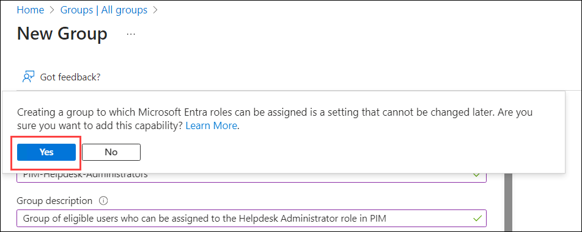
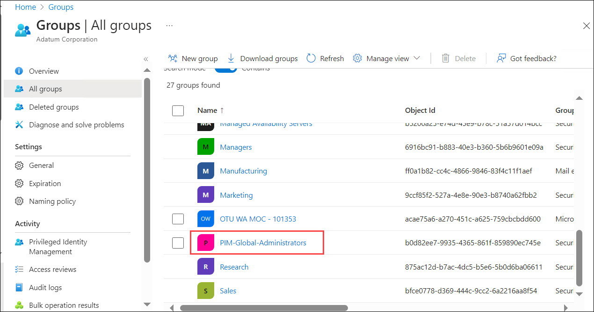
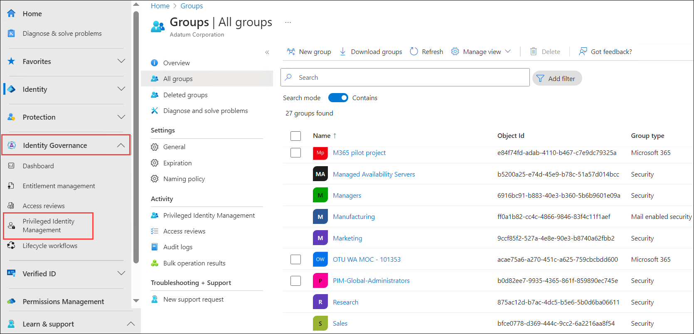
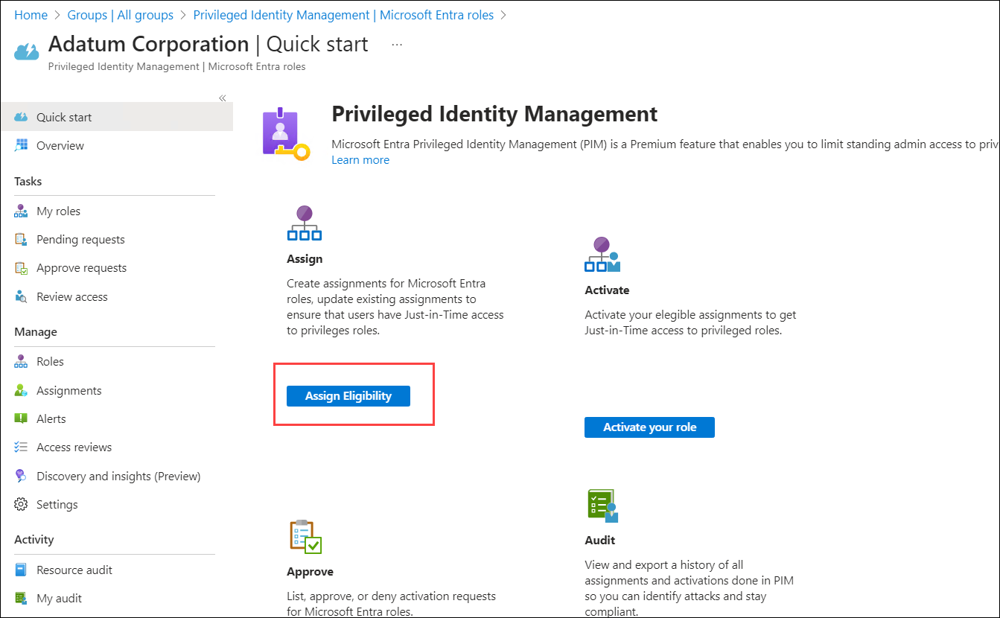
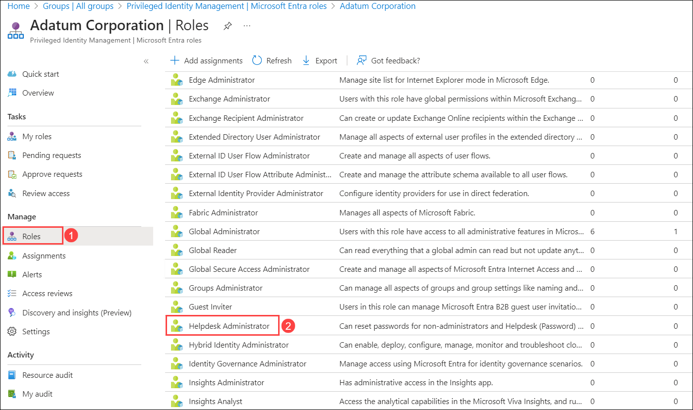
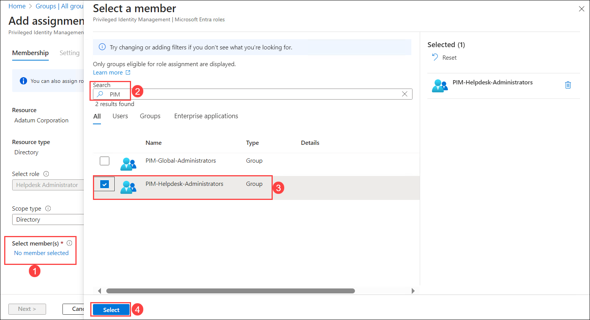
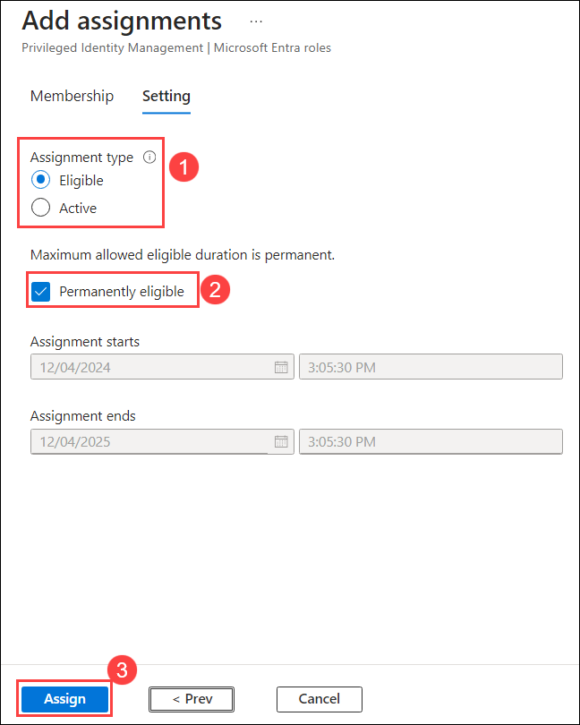
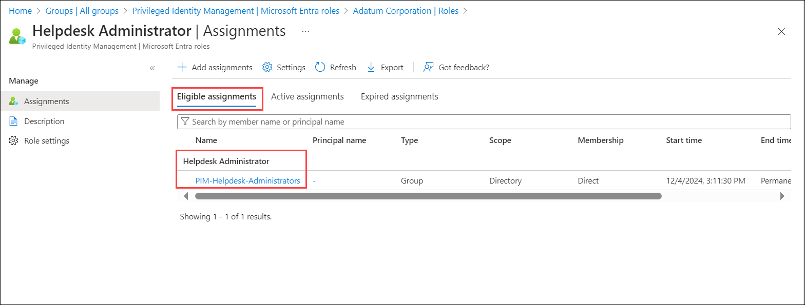

# Learning Path 4 - Lab 4 - Exercise 2 - PIM Self-Approval

## Lab scenario

Since taking on her role as Adatum's Microsoft 365 Administrator, Holly Dickson has been interrupted on several occasions with user support requests that have taken her attention away from the company's Microsoft 365 pilot project. Because Holly does not have the bandwidth to respond to the requests in a timely manner, she wants Alex Wilber and Joni Sherman to begin responding to these requests. This will require that Alex and Joni have Helpdesk Administrator role permissions.  However, Holly does not want to permanently assign this role to Alex and Joni, since this is not their regular role, and she doesn't want this role to impact other services. Holly also doesn't want Alex and Joni to submit approval requests each time they need to be assigned the Helpdesk Admin role.

Given these requirements, Holly wants to take advantage of the Privileged Identity Management (PIM) feature that enables users to self-activate an Microsoft Entra role on an as-needed basis. Instead of requiring a Global admin (such as Holly) or a Privileged Role Administrator to assign a role to multiple people individually, PIM enables an organization to create a security group and then enable the group to be eligible for that specific role. When people are assigned as members of the group, they indirectly become eligible to be assigned the role. Holly wants to employ this feature at Adatum by creating a security group of eligible users (Alex and Joni) for the Helpdesk administrator role. This opportunity will be a good test of this feature in Holly's pilot project.

Once Alex and Joni are made eligible for this role, whenever they must respond to their first user request, they will self-activate, or self-approve the role assignment. By doing so, they will have Helpdesk administrator control for a predetermined time period. In this case, Holly wants them to remain assigned to the role for 15 days. 

In addition, Holly doesn't want to be forced to approve the role assignment whenever Alex and Joni require this role assignment. Instead, Holly simply wants to be notified whenever Alex or Joni self-approve the role. PIM can send email notifications to selected individuals when important events occur in their Azure Active Directory organization, such as when a role is assigned or activated.  

### Task 1 - Create an eligible group for the Helpdesk Admin role

1. You should still be logged into LON-CL1 as the local **adatum\administrator** account, and in your Edge browser, you should still be logged into Microsoft 365 as Holly Dickson.

2. In your Edge browser, select the tab containing the **Microsoft Entra admin center**, which should still be open from the prior lab exercise. 

3. In the **Microsoft Entra admin center**, in the left-hand navigation pane, under **Identity**, select **Groups** and then select **All groups**.

    

4. In the **Groups | All groups** window, select **New group** in the menu bar.

    

5. In the **New group** window, enter the following information:

    - Group type - **Security**

    - Group name - **PIM-Helpdesk-Administrators**

    - Group description - **Group of eligible users who can be assigned to the Helpdesk Administrator role in PIM**

    - Microsoft Entra roles can be assigned to the group - **Yes**

    - Membership type - **Assigned**

    - Owners - Select **No owners selected**. In the **Add owners** pane, enter **Holly** in the **Search** field and select the **Holly**'s user account.

    - Members - Select **No members selected**. In the **Add members** pane, Enter **Alex** in the search field and then select **Alex Wilber**. Enter **Joni** in the Search field, and then select **Joni Sherman**.

6. In the **New group** window, select the **Create** button at the bottom of the page.

     

7. A dialog box appears at the top of the page that says: **Creating a group to which Microsoft Entra roles can be assigned is a setting that cannot be changed later. Are you sure that you want to add this capability?**. Select **Yes**.

     

8. On the **Groups | All groups** window, if the **PIM-Helpdesk-Administrators** group does not appear below the PIM-Global-Administrators group that you created in the prior task, select **Refresh** on the menu bar.

     

9. You must now make the **PIM-Helpdesk-Administrators** group eligible for role assignment. In the left-hand navigation pane, select **Identity Governance** to expand the section, and then select **Privileged Identity Management**.

     

10. In the **Privileged Identity Management | Quick start** window, in the middle pane under the **Manage** section, select **Microsoft Entra roles**.

     

11. In the **Adatum Corporation | Quick start** window, under the **Assign** section, select the **Assign Eligibility** button.

     

12. In the **Adatum Corporation | Roles** window, scroll down through the list of roles and select **Helpdesk Administrator**.

     

13. In the **Helpdesk Administrator | Assignments** window, select **+ Add assignments** on the menu bar. 

     

14. In the **Add assignments** window, the **Membership** tab is displayed by default. Under **Select member(s)**, select **No member selected**.

15. In the **Select a member** pane that appears on the right, enter **PIM** in the **Search** field. This will display the list of eligible users and groups whose name starts with **PIM**. Select the **PIM-Helpdesk-Administrators** group that appears, and then select the **Select** button.

     

16. In the **Add assignments** window, select **Next >** (this does the same thing as selecting the **Setting** tab). 

     

17. In the **Add assignments** window, under the **Setting** tab, verify the **Assignment type** option is set to **Eligible**. Also verify the **Permanently eligible** check box is selected (if not, then do so now), and then select **Assign**. 

     

18. In the **Helpdesk Administrator | Assignments** window, note that the **PIM-Helpdesk-Administrators** group is an eligible assignment to the Helpdesk Administrator role. Because **PIM-Helpdesk-Administrators** is a group, it means that all members of this group (which consists of Alex Wilber and Joni Sherman) are now eligible to be assigned the Helpdesk Administrator role.

     

    >**Note:** Lab testing has shown that it can sometimes take up to 30 minutes for new assignments to appear under the **Eligible assignments** tab. If **PIM-Helpdesk-Administrators** doesn't appear immediately, wait a few minutes and then select the **Refresh** option on the menu bar. Continue to select the **Refresh** option every few minutes until **PIM-Helpdesk-Administrators** appears in the list of **Eligible assignments**.
   
19. Leave all browser tabs open for the next task.

### Task 2 - Configure the Helpdesk Administrator role for self-activation

1. On LON-CL1, in your Edge browser, you should still be logged into Microsoft 365 as Holly Dickson from the prior task.

2. In your browser, you should still have the **Microsoft Entra admin center** open from the prior task. In the left-hand navigation pane, under the **Identity Governance** section, select **Privileged Identity Management**.

3. In the **Privileged Identity Management | Quick start** window, in the middle pane under the **Manage** section, select **Microsoft Entra roles**.

4. In the **Adatum Corporation | Quick start** window, in the middle pane under the **Manage** section, select **Settings**. 

5. In the **Adatum Corporation | Settings** window, select the **Helpdesk Administrator** role.

    *>*Tip:** If the roles are not displayed in alphabetical order, select the **Role** heading to sort them in ascending alphabetical order. This will make it easier to locate the Helpdesk administrator role.

6. In the **Role setting details -  Helpdesk Administrator** window, scroll through the page and review the information for role activation, assignment, and notification. Then select **Edit** on the menu bar at the top of the page.

7. In the **Edit role setting - Helpdesk Administrator** window, the **Activation** tab is displayed by default. In this tab, the slider for the **Activation maximum duration (hours)** setting is set to **8**. Holly wants to increase this to the maximum allowable time, which is **24** hours. You can either move the slider to the end of the line, or you can type **24** in the field next to the slider. 

    >**Note:** If you try to enter any value greater than 24, it will automatically reset to 24.

8. Below the activation slider, set the **On activation, require** setting to **None**.

    >**Note:** In the prior lab exercise, Holly required that Patti Fernandez sign in using Azure MFA when she requested activation of the Global admin role. In doing so, Holly verified the Azure MFA sign-in worked. However, for the purpose of the pilot project, Holly will not require verification using multi-factor authentication when activating the Helpdesk administrator role (and since you already tested this MFA feature in the prior lab exercise, there's no reason to take time in class to do it again). 

9. The screen then displays a group of three settings, each with a check box. Verify that all three check boxes are blank. If any check box is selected by default, then un-check (clear) it now. 

    >**Note:** For the pilot project, Holly does not want the **Require justification on activation** check box selected. Holly knows that Alex and Joni will only activate the role when needed, so she doesn't require a justification from them to activate the role assignment (however, in the next step, Holly will require justification when they assign the role to themselves). Leaving the **Require approval to activate** setting unchecked will enable an eligible user to self-approve, or self-activate without requiring another user's approval.

10. You're currently in the **Activation** tab. Select the **Next: Assignment**. When this role is assigned to Alex or Joni, Holly wants the assignment to expire after 15 days. To implement this requirement, configure the following settings on this tab:

    - Uncheck (clear) the **Allow permanent active assignment** check box. Then select the **Expire active assignments after** field, and in the drop-down menu that appears, select **15 days**.

    - Verify the **Require justification on active assignment** check box is selected (if not, select it now).

11. Select the **Next: Notification**.

12. On the **Notification** tab, note the three activities that can trigger a notification being sent: **Send notifications when...**

    - members are assigned as eligible to this role
    - members are assigned as active to this role
    - eligible members activate this role

    Under the **Send notifications when eligible members activate this role** section, Holly wants to be notified when Alex or Joni self-approve this role. Therefore:

    - Verify the **Role activation alert** check box is selected.
    - The default recipient for the **Role activation alert** is **Admin**. This refers to the Global Administrators (Holly) and any Privileged Role Administrators. 
    - Un-check (clear) the **Notification to activated user (requestor)**. Since Alex and Joni will be self-approving, they don't need to receive a notification when they do so.

13. Select the **Update** button at the bottom of the window.

14. Leave all browser tabs open for the next task.

### Task 3 - Self-activate the Helpdesk Admin role

1. In LON-CL1, right-click on the **Edge** icon on the taskbar and in the menu that appears, select **New InPrivate window**. 

2. In your InPrivate browsing session, enter the following URL in the address bar: **https://portal.azure.com**

3. You're now going to log into Azure as Alex Wilber. In the **Sign in** window, enter **alex wilber**'s account and then select **Next**. In the **Enter password** window, enter the password and then select **Sign in**. In the **Stay signed in?** dialog box, select the **Don't show this again** check box and then select **Yes**.

4. In the **Welcome to Microsoft Azure** dialog box that appears, select **Maybe later** to skip the tour.

5. In the **Microsoft Azure** portal, in the middle of the screen is the section of **Azure services**. This section displays a row of Azure services and their associated icons. At the end of the row, select **More services** (with the forward arrow icon). This opens the **All services** window.

6. In the **All services** window, enter **priv** in the **Filter services** search box at the top of the page. In the list of search results, select **Microsoft Entra Privileged Identity Management**.

7. In the **Privileged Identity Management | Quick start** window, in the **Tasks** section in the left-hand navigation pane, select **My Roles**.

8. In the **My roles | Microsoft Entra roles** window, the **Eligible assignments** tab is displayed by default. Remember, in the prior task Holly assigned Alex as a member of the **PIM-Helpdesk-Administrators** group, which Holly later assigned as an eligible group for the Helpdesk Administrator role. As such, this role appears in the list of **Eligible assignments** for Alex. Select the **Active assignments** tab. Note that no Microsoft Entra roles have yet to be assigned to Alex's account. 

9. Alex is now ready to self-approve, or self-activate the Helpdesk administrator role. Select the **Eligible assignments** tab. Under the **Action** column for the **Helpdesk Administrator** role, select **Activate**.

10. In the **Activate - Helpdesk Administrator** pane that appears, enter **Support requests from Sales team members that require resolution** in the **Reason** field. This is the reason why Alex wants to self-activate this role. Then select the **Activate** button at the bottom of the pane. Note the three stages of activation that appear in the **Activate - Helpdesk Administrator** pane and the progress made on each stage. Wait for all three stages to automatically complete (Stage 2 typically takes the longest). After the final stage is completed, the **Activate - Helpdesk Administrator** pane will automatically close, and you will be returned to the **My roles | Microsoft Entra roles** window.

11. On the **My roles | Microsoft Entra roles** window, note that you're still in the **Eligible assignments** tab. Also note the message at the top of the window indicating **Your active roles have changed. Click here to view your active roles**. Select this message. This simply displays the **Active assignments** tab, which you could have selected yourself instead of selecting the message. 

12. In the **Active assignments** tab, note the **Helpdesk Administrator** role now appears. Prior to activating this role, remember that you checked this tab earlier and no Microsoft Entra roles appeared. Now that Alex has self-approved the **Helpdesk Administrator** role, it's now been assigned to his user account. 

13. Close the InPrivate browser session. This should return you to the **Microsoft Entra admin center**, which should be displaying the **Adatum Corporation | Settings** page.

14. Leave your browser and all tabs open for the next task.

As Alex Wilber, you have now self-approved the Helpdesk Administrator role. This has automatically assigned the role to Alex's user account.

### Task 4 -  Verify a PIM notification was issued

1. On LON-CL1, in your Edge browser, you should still be logged into Microsoft 365 as Holly Dickson. In your Edge browser, select the **Home | Microsoft 365** tab.

2. On the **Welcome to Microsoft 365** page, in the column of application icons on the left-side of the screen, select the **Outlook** icon. This will open Outlook for Holly Dickson's mailbox in a new tab.

3. In Holly's Outlook mailbox, her **Inbox** is displayed by default. Verify that Holly received a PIM generated email indicating that **Alex Wilber activated the Helpdesk Administrator role assignment**. 

4. Select the email to open it. Review the information in the email and then close it. 

5. To review the audited list of activities related to Alex's self-approval of the Helpdesk Administrator role, select the **Microsoft Entra admin center** tab in your Edge browser. 

6. In the **Microsoft Entra admin center**, the **Adatum Corporation - Settings** page should be displayed. This is where you left off in the prior task. In the middle pane, under the **Activity** section towards the bottom of the page, select **Resource audit**.

7. In the **Adatum Corporation | Resource audit** page, review the list of PIM activities. Note the two most recent activities, which include Alex's request to be assigned to the Helpdesk Administrator role, and the completion of Alex's request. 

8. Leave your browser and all tabs open for the next task.

> **Congratulations** on completing the task! Now, it's time to validate it. Here are the steps:
- Click the Lab Validation tab located at the upper right corner of the lab guide section and navigate to the Lab Validation Page.
- Hit the Validate button for the corresponding task. If you receive a success message, you can proceed to the next task. 
- If not, carefully read the error message and retry the step, following the instructions in the lab guide.
- If you need any assistance, please contact us at labs-support@spektrasystems.com. We are available 24/7 to help you out.

## Review

In this lab, you have:

- Created an eligible group for the Helpdesk Admin role.
- Configured the Helpdesk Administrator role for self-activation.
- Self-activated the Helpdesk Admin role.
- Verified a PIM notification was issued.

## Proceed to the next exercise.
