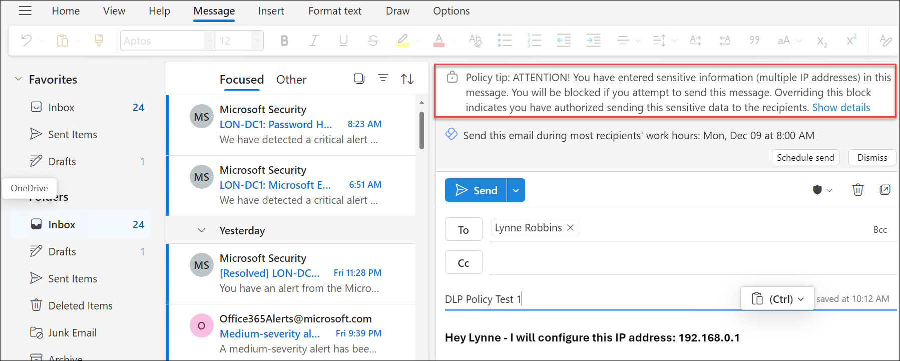
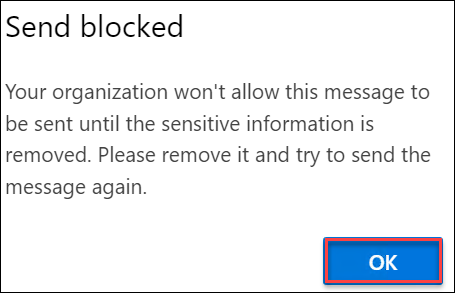

# Learning Path 8 - Lab 8 - Exercise 2 - Test the DLP Policy

## Lab scenario

Holly Dickson is now at the point in her pilot project where she wants to test the DLP policy related to emails that contain sensitive information that you created in the previous lab exercise. 

>**NOTE:** We have intermittently experienced issues in the past where DLP policies and policy tips do not work as expected in this lab exercise. This is due to throttling issues that sometimes occur between our VM lab environment and the Microsoft 365 trial tenant. This is not indicative of the normal experience within Microsoft 365 production environments. It is also not indicative of the normal training experience. We apologize if you run into this issue during this lab exercise.

### Task 1 – Test the first DLP Policy rule

1. On LON-CL1, in your Edge browser, you should still be logged into Microsoft 365 as **Holly Dickson**. 

1. You will now send an email from Holly to Lynne Robbins, and you will include an IP address in the body of the email. In **Microsoft Edge**, select the **Microsoft Office Home** tab, and then select the **Outlook** icon in the column of app icons on the left-side of the screen. When Outlook on the web opens, you should be automatically logged in as Holly Dickson.  

	>**Note:** If **Outlook on the web** was already open, then verify that you're logged in as **Holly** by checking the user icon in the upper right corner (the **HD** circle). If Outlook was open for any other user, then close the tab and repeat the instructions in this step to open Outlook on the Web for Holly.

1. In the upper left corner of the screen, select **New mail**. 

1. In the message pane that appears on the right-side of the screen, enter the following information:

	- To: enter **Lynne** and then select **Lynne Robbins** from the user list that appears

	- Add a subject: **DLP Policy Test 1**

	- Message area: **Hey Lynne - I will configure this IP address: 192.168.0.1**

	>**Note:** When drafting this email with sensitive data (in this case, one IP address), it will trigger the IP address policy that you previously created, and specifically, the single IP address rule. As such, a Policy tip should be displayed indicating the email message violates an organizational policy. You'll ignore this policy tip and send the email anyway in order to test the remainder of the DLP policy, which will send a Notification email to Holly.

		

	- If you will recieve a **Send blocked** pop-up which, select **OK**.

		

1. Leave the Outlook tab open in the Edge browser for the next task. 

	
### Task 2 – Test the second DLP Policy rule  

1. On LON-CL1, in your Edge browser, you should still be logged into Microsoft 365 as **Holly Dickson**. 
	
2. You will now send a second message from Holly to Lynne that contains multiple IP addresses. Repeat the process as before for creating an email to Lynne Robbins with the following information: 

	- Add a subject: **DLP Policy Test 2**

	- Message area: **Hey Lynne - I will test the following IP addresses: 192.168.0.1 and 172.16.0.1**

3. Select **Send**. You should immediately receive a **Send blocked** pop-up.

<!-- 6. To send this email, you must override the block BEFORE you select the **Send** button. To override the block, in the policy tip that appears at the top of the message, select **Show details**.

7. In the detail message that appears in the policy tip, select **Override**.

8. In the dialog box that appears, the **I have a business justification** option is selected by default. Leave this option selected and enter **Lynne must be informed of the IP addresses I'm testing** in the **Enter explanation here** field. Select **Override**.	

	>**Note:** how the policy tip message has changed to indicate you have chosen to send the message even though it appears to contain sensitive information.

9. Select Holly's **Sent Items** folder to verify the email was sent.

10. Select Holly's **Inbox** folder. Holly should receive an email from **Microsoft Outlook** with the subject: **Notification: DLP Policy Test 2**. Select this email and review its content.
	
11. Switch to **LON-CL2**. 

12. You should still be logged into **Outlook on the Web** in the LON-CL2 VM as **Lynne Robbins**. In your **Edge** browser, Lynne’s mailbox should still be open in **Outlook on the web** from when you last used it in the previous task.

13. In Lynne's Inbox, verify that she received the email from Holly Dickson that has the subject line: **DLP Policy Test 2**. Select the message to verify the content containing the IP addresses was not removed. -->

14. Leave the Outlook tab open in the Edge browser for the next task.

## Review

In this lab, you have:

- Tested the first DLP Policy rule.
- Tested the second DLP Policy rule.

## You have successfully completed Lab 08. Proceed to the next exercise.
